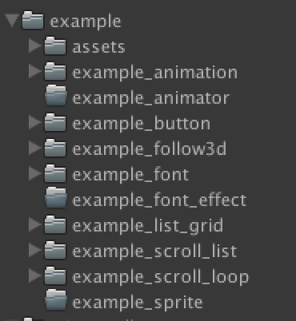

# Unity3DuGUI-Toolkit
In Unity3D 5.6.2+ , the uGUI has not enough compontent to build GUI system. So this repository can improve it .

# uGUI Tool kit
---------------------

### 是什么(What is it)
* Unity3D 5.6.2+ 以后的版本中 uGUI为主导的gui系统，组件并不齐全，以至于用起来非常费力。
* 这个Repository 是对uGUI的一个工具箱，用来帮助那些想用uGUI打造GUI系统的开发者们。

### 内容介绍(Introduce)
	UI_Animator
	ui animator component. This script can improve animation when u use animator to perform.

	UI_CountDisplayer
	Count number from small to big.

	UI_Follow3D
	make the ui follow 3d whatever it move to any place.

	UI_ButtonPlaySound
	It can help you play sound when you click button.

	UI_FontNum
	It can use texture to display number whatever you put in several number in it.

	UI_ListGrid
	Look like LayoutGrid, and the same function. maybe i will remove it later.

	UI_Scroll_Loop
	Help you to create a loop scroll view. you can see it in the scroll loop example to understand what is it and how to use.

	UI_ScrollListSenior
	Help you to create a Scroll list which can add large mount units in it and performance really good. You can see the scroll list senior example to know what is it and how to use.

	GUIUtil
	Util for GUI.

	UI_Event
	The event of the gui. we use UI_Event to add input listener. So it is the core of gui.

	UI_TweenColor
	Help you to create Tween color animation in ui.

	UI_TweenGroup
	help you to create tween alpha animation in ui.

	UI_TweenPosition
	help you to create tween position animation in ui.

	UI_TweenRotation
	help you to create tween rotation position animation in ui.
	
	UI_TweenScale
	help you to create  tween scale position animation in ui.

### Example

